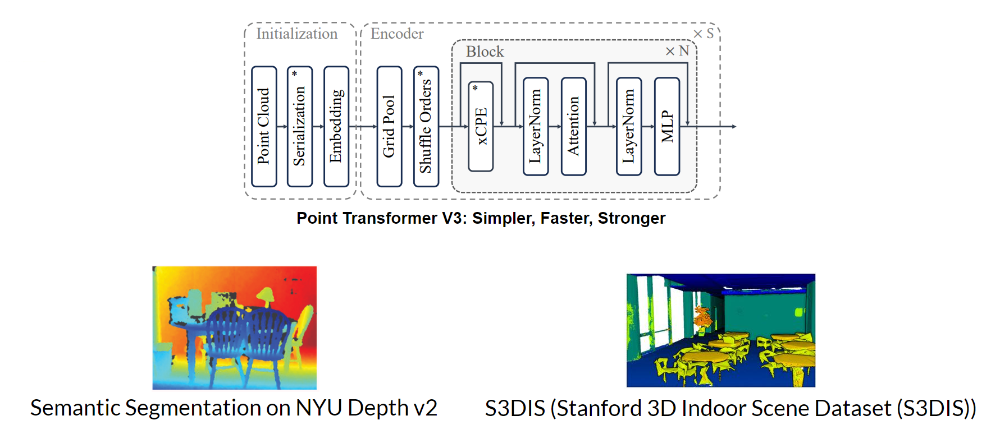
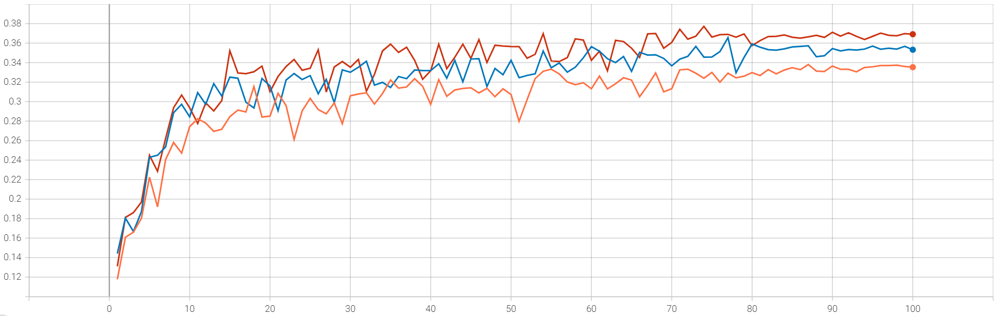

# PointTransformerV3-SemSeg
PointTransformerv3 practice using PyTorch

## 1. What is this for?
The purpose of this repo is to practice using PTV3(PointTransformerV3). The dataset I used for training PTV3 was S3DIS and NYU(NYU Depth V2). The original NYU contains 2D depth map and RGB images. Therefore, I had to convert these 2D depth images into point cloud format. I will talk more about the datasets later in the 'Dataset Preparation' section.

## 2. GPU Specification
I used 4 A6000 GPUs. It took about 28 hours to run 100 epochs.

## 3. Installation
Follow the steps below
- conda update -n base -c anaconda conda
- conda create -n pointcept python=3.8 -y
- conda activate pointcept
- conda install -y ninja

The authors of PointTransformerV3 used CUDA==11.8 and PyTorch==2.1.0 (this job might take long)
- conda install pytorch==2.1.0 torchvision==0.16.0 torchaudio==2.1.0 pytorch-cuda=11.8 -c pytorch -c nvidia
- conda install -y nvidia/label/cuda-11.8.0::cuda-toolkit

Check if CUDA is available
- pytorch
- import torch
- torch.cuda.is_available()

Continue on with the installation process
- conda install h5py pyyaml -c anaconda -y
- conda install sharedarray tensorboard tensorboardx yapf addict einops scipy plyfile termcolor timm -c conda-forge -y
- conda install pytorch-cluster pytorch-scatter pytorch-sparse -c pyg -y
- pip install torch-geometric

- git clone https://github.com/Pointcept/PointTransformerV3.git
- cd ./Pointcept/libs/pointops
- python setup.py install

Go back to the main folder
- git clone https://github.com/Pointcept/Pointcept.git
- cd ./Pointcept

Make sure you are downloading the version that matches your CUDA version
- pip install spconv-cu118

This is optional
- pip install open3d

Okay continue on! Let's install FlashAttention
- pip install flash-attn --no-build-isolation

## 4. Dataset Preparation
The two datasets I used were S3DIS(Stanford 3D Indoor Scene Dataset) and NYU(NYU Depth V2).

### 4.1. S3DIS
Thankfully, the authors of PointTransformerV3 provid a preprocessed dataset. 
- Click on the link below to download the dataset.  
https://connecthkuhk-my.sharepoint.com/personal/wuxy_connect_hku_hk/_layouts/15/onedrive.aspx?ga=1&id=%2Fpersonal%2Fwuxy%5Fconnect%5Fhku%5Fhk%2FDocuments%2Fresearch%2FDatasets%2Fs3dis%2Ezip&parent=%2Fpersonal%2Fwuxy%5Fconnect%5Fhku%5Fhk%2FDocuments%2Fresearch%2FDatasets&p=14
- Unzip the file
- create a link like this
ln -s LOCATION_OF_THE_UNZIPPED_DATASET/datasets/s3dis/ ./data/s3dis

### 4.2. NYU
You can find all the information about how I converted NYU to point cloud data by clicking [HERE](https://github.com/parkie0517/NYUDepthV2_PointCloud_Converter).

## 5. Training

### 5.1. S3DIS
- open up './Pointcept/configs/s3dis/semseg-pt-v3m1-0-rpe.py'
- go to line 69 and make sure the dataset path is properly assigned to 'data_root' variable
- then, run the command below to train!
- sh scripts/train.sh -p python -g 4 -d s3dis -c semseg-pt-v3m1-0-rpe -n semseg-pt-v3m1-0-rpe

### 5.2. NYU
- open up './configs/semseg-pt-v3_NYU.py'
- go to line 73 and make sure the dataset path is properly assigned to 'data_root' variable
- now run the command below to start training!
- sh scripts/train.sh -p python -g 4 -d s3dis -c semseg-pt-v3_NYU -n semseg-pt-v3_NYU

## 6. Testing

### 6.1. NYU
Testing of the NYU test dataset can be conducted following the steps below.
1. open up './configs/semseg-pt-v3_NYU.py'
2. go to line 73 and make sure the dataset path is properly assigned to 'data_root' variable
3. now run the command below to start testing
    - sh scripts/test.sh -p {INTERPRETER_PATH} -g {NUM_GPU} -d {DATASET_NAME} -n {EXP_NAME} -w {CHECKPOINT_NAME}
    - sh scripts/test.sh -p python -g 4 -d s3dis -c semseg-pt-v3_NYU -n semseg-pt-v3_NYU -w model_best

## 7. Results

### 7.1. S3DIS
I achieved the same result that was presented in the original PointTransformerV3 paper.

### 7.2. NYU
#### 7.2.1. Validation Result
I trained the model 3 times. Each time, there was a slight difference in the way I trained the model.

| Training | Input                         | Loss                                 | Best mIoU (%) |
|----------|-------------------------------|--------------------------------------|---------------|
| Train 1  | Point Cloud, RGB              | All 41 Classes                       |  33.81       |
| Train 2  | Point Cloud, RGB              | 40 Classes (excluded the void class)  | 36.56         |
| **Train 3**  | **Point Cloud, RGB, Normal Vector**| **40 Classes (excluded the void class)**  | **37.72**          |

Below is the validation mIoU during trianing.  

(Orange: Train 1, Blue: Train 2, Red: Train 3)

#### 7.2.2. Test Result
At epoch 74 the validation mIoU was the highest. Therefore, the test dataset evaluation was done using the best model saved at epoch 74. Below are the results.
- mIoU: 0.3882  
- mAcc: 0.4799  
- allAcc: 0.7085  

In the discussion section, I will talk about why the result was so low.

## 8. Visualization
Inorder to visualize the predicted results, you need to run the test code first!

### 8.1. NYU
.png)

### 9.1. ScanNet vs ScanNet200
- The only difference between the two datasets are the number of classes. ScanNet and ScanNet200 have 21 and 200 classes, respecitvely. Interestingly, the performance dropped by a large margin when the number of classes increased.

### 9.2. NYU
- It is important to exclude unecessary classes such as void, during training.
- Though the noraml vector was computed using the 2D depth map, it still offered valuable information to the model.
- The performance of NYU was relatively low compared to S3DIS and ScanNet for 4 reasons
    - Incompleteness of the point cloud data. As you can see from the NYU visualization, lots of part are empty.
    - The point cloud data converted from the RGB-D dataset is very sparse.
    - It is very difficult to calibrate the RGB and Depth sensors. If you look closely into the NYU visaulization result, you can see a telephone on the desk. But if you look at the "Point Cloud + RGB (from different angle)", you can see that the telephone is strathced. Therefore, the conversion process from an RGB-D to a Point Cloud creates a noise (corruption).
    - More classes (NYU has 40 classes)
